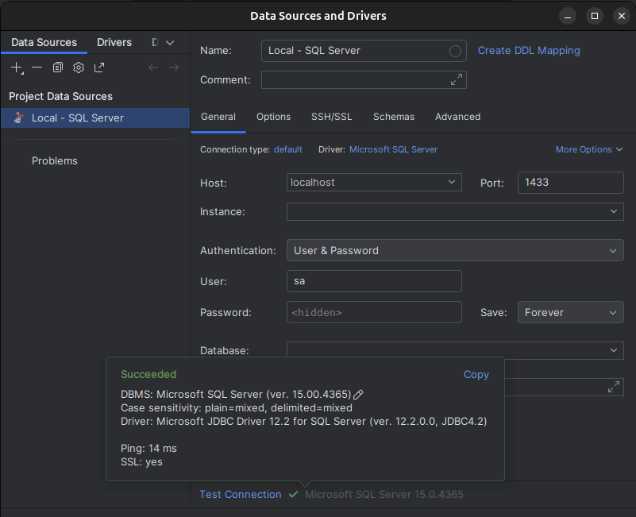

# SQL Server com Docker
Este é um ambiente simples de desenvolvimento com SQL Server para facilitar testes e desenvolvimento, eliminando a necessidade de usar o Windows como sistema operacional. O uso do Docker torna a configuração rápida e portátil.

## Pré-requisitos
[Docker instalado](https://docs.docker.com/get-docker/) e funcionando em sua máquina.

## Instalação
### Clone o repositório:
```sh
git clone git@github.com:hugojunior/sql-server-docker.git && cd sql-server-docker
```

## Configuração
O arquivo `docker-compose.yml` contém as configurações do projeto. Caso precise usar uma porta específica ou alterar a senha do banco de dados, edite este arquivo antes de iniciar o serviço.

### Iniciando o serviço:
```sh
docker compose up -d
```
### Parando o serviço:
```sh
docker compose stop
```

> [!NOTE]
> Em alguns casos, você pode não ter permissões suficientes para acessar a pasta `drive`. Para solucionar esse problema, execute o seguinte comando com privilégios de sudo: `sudo chmod -R a+rwX drive`

## Conexão ao banco de dados
Para conectar ao banco de dados SQL Server, utilize as seguintes informações:

- Host: 127.0.0.1
- User: sa
- Password: sqlServer(!)Password

### Exemplo 

#### Usando [sqlcmd](https://learn.microsoft.com/pt-br/sql/tools/sqlcmd/sqlcmd-utility)
```sh
sqlcmd -S 127.0.0.1 -U sa -P 'sqlServer(!)Password' -Q "CREATE DATABASE MeuBancoDeDados;"
```

#### Usando [DataGrip](https://www.jetbrains.com/datagrip/)



## Localização dos dados
Os arquivos do banco de dados ficam armazenados em uma pasta chamada `drive` na raiz do projeto após a inicialização do container. Essa pasta é ideal para realizar backups ou garantir a persistência dos dados mesmo que o container seja excluído.
